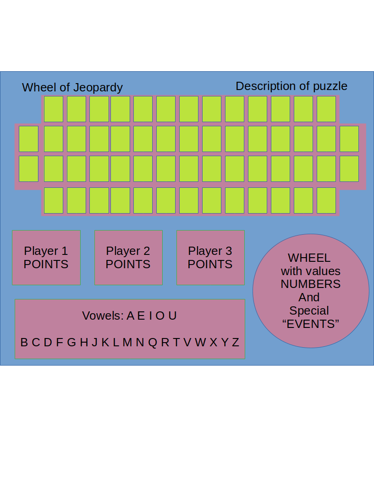

# Wheel Of Jeopardy
This is a project 01 from Software Engineering Imersive bootcamp General Assembly 2019, cohort 23.

# Wheel Of Jeopardy

_crazy combination of two the most popular American TV Show Games_

```
Highlits specifications:
● One round game
● 3 players
● Collecting points
● Answering questions (as Jeopardy)
● Solving PUZZLE (as Wheel of Fortune)
● Set amount for Jeopardy when solving PUZZLE
● JEOPARDY: wrong solution = lost the amount
```

