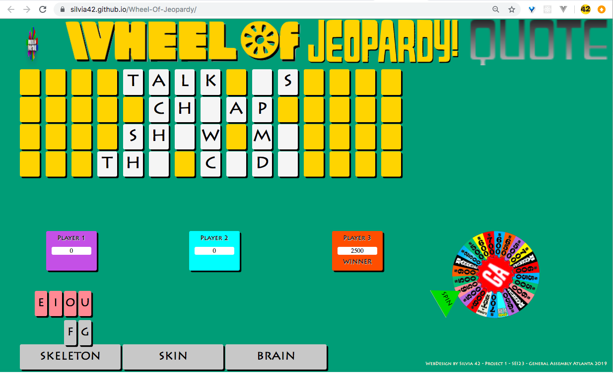

This is a project 01 from Software Engineering Imersive bootcamp General Assembly 2019, cohort 23.

# Wheel Of Jeopardy

_crazy combination of two the most popular American TV Show Games_

```
Highlits specifications:
● One round game
● 3 players
● Collecting points
● Answering questions (as Jeopardy)
● Solving PUZZLE (as Wheel of Fortune)

```

<a href="https://github.com/Silvia42/Wheel-Of-Jeopardy/projects/1">Kanban Project Board</a>

<a href="https://silvia42.github.io/Wheel-Of-Jeopardy/">Application</a>

### GAME RULES of Wheel of Jeopardy (high level)
*Detailed rules are written in JavaScript Code*

This is a game for 3 player.

__Player 1__ is starting the game with choosing a consonant without Jeopardy Q/A.
If consonant is not in the Puzzle, he/she is loosing turn and __Player 2__ is continuing.

Game cycle is: 
#### TURN - CHOOSE LETTER - JEOPARDY Q/A - REPEAT

Player lost his/her turn when:
- wrong at Jeopardy Q/A
- letter is not in Puzzle

Player lost POINTS when:
- wrong at Jeopardy Q/A, lost amount equal to value on the wheel
- get BANKRUPT,

Player get POINTS when:
- correct at Jeopardy Q/A and letter is in PUZZLE, get amount equal to value on the wheel

#### Special fields on the Wheel:
##### BANKRUPT: 
lost everything, if she/he has negative value, "lost" it also, will have ZERO always after bankrupt
##### LOST A TURN: 
player lost a turn, but her/his points stay unchanged
##### FREE PLAY:
can choose letter without solving Jeopardy Q/A, If letter is in the Puzzle, will get  amount equal to value on the wheel

### WINNIG GAME
Player can solve PUZZLE only when he/she is ACTIVE (his/her regular turn).
If solution is correct, he/she is a WINNER. If solution is incorrect, game continuing, points are not changed.


### WireFrame


### Screen Shots of Application

#### Screen at the beginning of the Game


#### Screen at solving the Jeopardy - choosing the Correct Question for the given Answer


#### Screen after selecting the Correct Question for given Answer for Jeopardy 


#### Screen at the middle of Game


#### Screen after BANKRUPT


#### Screen at the middle of continuing Game


#### Screen later in the GameScreen with solving the main PUZZLE


#### Screen after Game - showing the Winner



